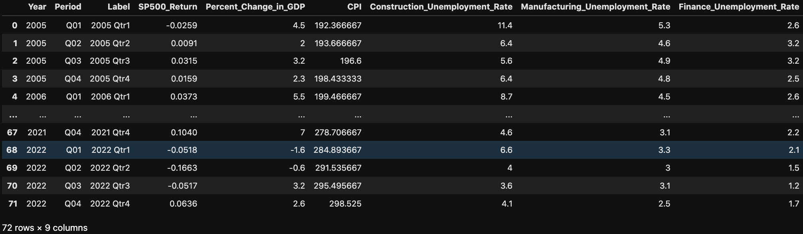
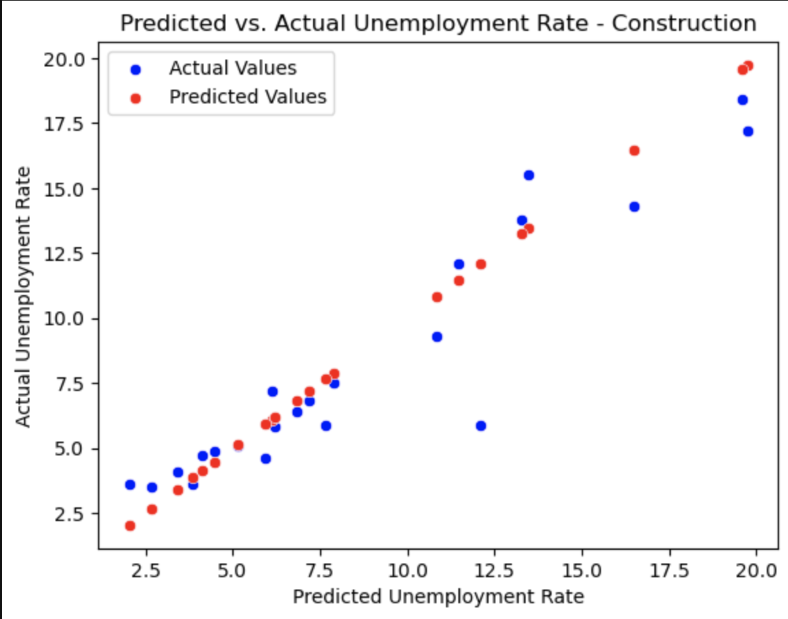
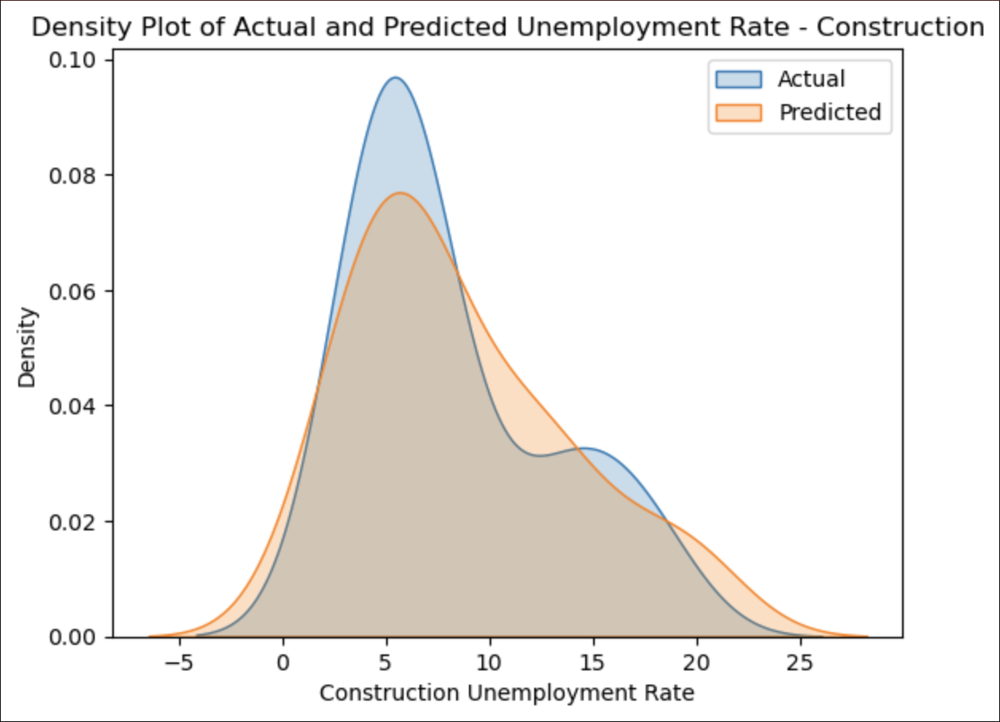
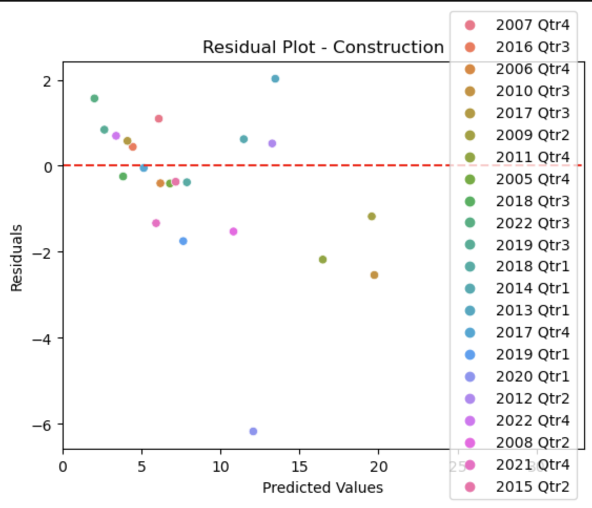
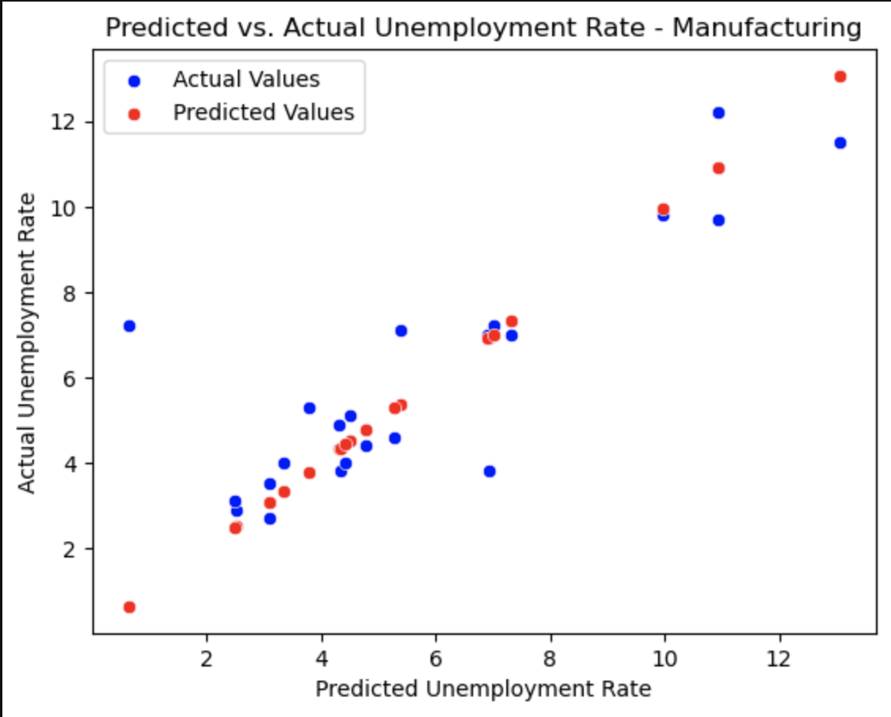
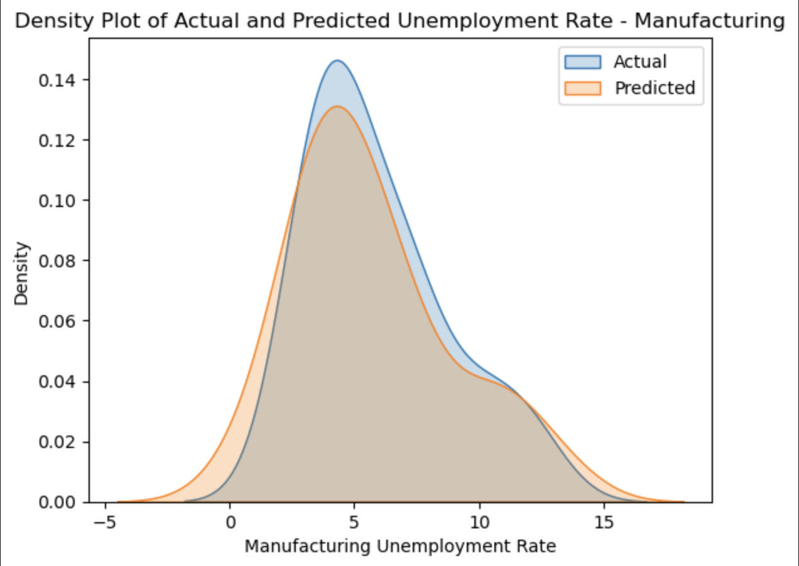
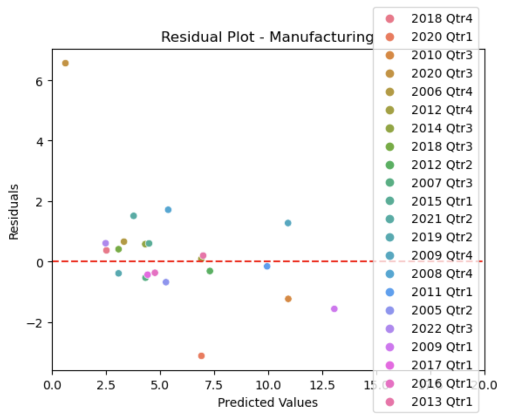
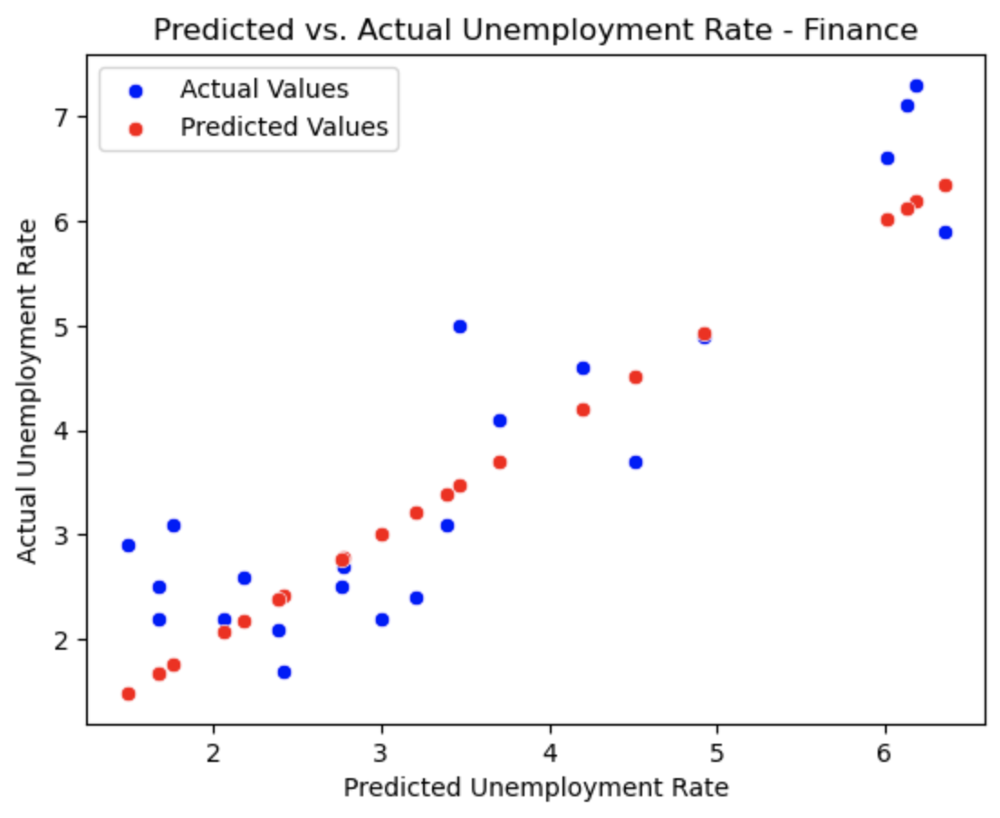
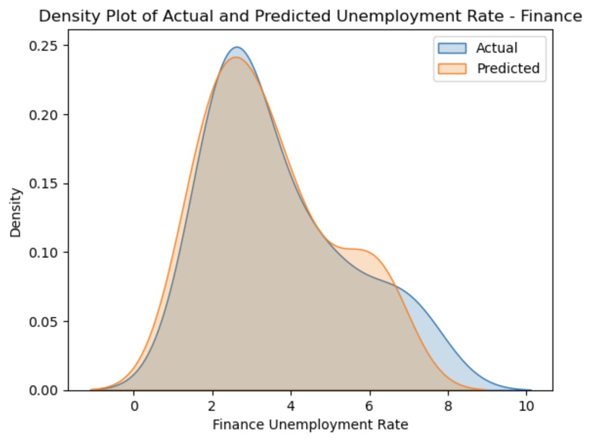
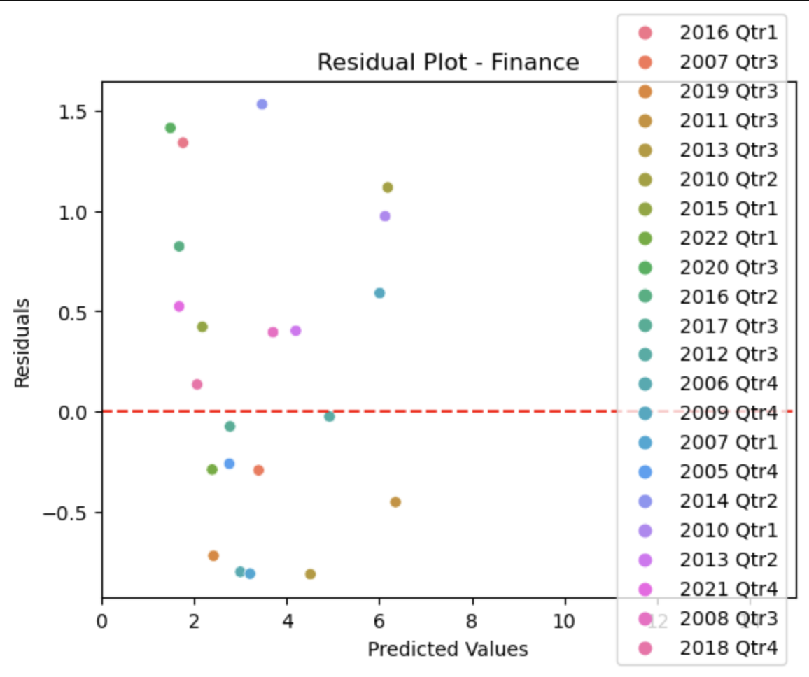

# Welcome to our team project website!

This is a website to showcase our final project for FIN 377 - Data Science for Finance course at Lehigh University.

This project and website was created by Tim DiPalo, Tom Griffith, and Christyan Jean-Charles.

To see the complete project repo, click [here](https://github.com/tdip19/FinalProject).

## Table of contents
1. [Introduction](#introduction)
    1. [Industry Choices](#subsec1-1)
2. [Methodology](#meth)
3. [Section 1](#section2)
    1. [Subsection](#subsec2-1)
    2. [Subsection](#subsec2-2)
4. [Section 1](#section3)
    1. [Subsection](#subsec3-1)
    2. [Subsection](#subsec3-2)
5. [Visualizations and Analysis](#section4)
    1. [Construction](#subsec4-1)
    2. [Manufacturing](#subsec4-2)
    3. [Finance](#subsec4-3)
6. [Findings and Conclusion](#conc)
7. [About the Team](#about)

## Introduction  <a name="introduction"></a>

The main goal of this project is to explore how we can use past data on industry trends and leading indicators to predict future employment and economic trends. We chose to explore this topic because, as we and our peers begin to move into the working world, we believe it is important to understand unemployment as it relates to job security. Especially now with many people predicting a recession, we think it is important to understand the employment trends in popular industries as they relate to economic trends.

### Why we chose these industries: <a name="industries"></a>

**Construction:** This was the inspiration for this project. While exploring topics, Tom stumbled upon this [video](https://www.youtube.com/watch?v=roEljzOKk3I&ab_channel=EPBResearch), detailing how the constuction employment is a significant driver of recessions in the US economy. We originally wanted to explore how different industries drive recessions, but we later decided to switch the angle in which we approached the project, instead researching how economic conditions affect unemployment in different industries. We felt that we should keep the construction industry as a homage to our original inspiration for the project.

**Manufacturing:** As supply chain majors, the manufaturing industy is important to Tim and Tom. Additionally, it is an industry that is very relevant to recent and soon-to-be Lehigh graduates overall.

**Finance:** This one is pretty clear. Since this is a finance class, most of us students are finance majors, and will likely be entering the finance industry soon. Therefore, it is important to understand the potential impact that economic conditions will have on employment rates.

## Methodology <a name="meth"></a>

We began by gathering data. We were able to find most of the employment data we needed from the Bureau of Labor Statistics and the Bureau of Economic Analysis. This was convient because, by getting the data from the same/similar sources, they were all formatted similarly. Therefore, there was minimal work needed to clean the data and prepare it for a merge.

Then, we were able to complete the minimal cleaning of the data so it was ready to merge, then merge it. The merged dataframe can be seen below.


<br><br>
Some analysis here

Here is some code that we used to develop our analysis. Blah Blah. [More details are provided in the Appendix](page2).
 
Note that for the purposes of the website, you have to copy this code into the markdown file and  
put the code inside trip backticks with the keyword `python`.

```python
import seaborn as sns 
iris = sns.load_dataset('iris') 

print(iris.head(),  '\n---')
print(iris.tail(),  '\n---')
print(iris.columns, '\n---')
print("The shape is: ",iris.shape, '\n---')
print("Info:",iris.info(), '\n---') # memory usage, name, dtype, and # of non-null obs (--> # of missing obs) per variable
print(iris.describe(), '\n---') # summary stats, and you can customize the list!
print(iris['species'].value_counts()[:10], '\n---')
print(iris['species'].nunique(), '\n---')
```

Notice that the output does NOT show! **You have to copy in figures and tables from the notebooks.**

## Regression Analysis <a name="section2"></a>
Christyan

### Subsection 1 <a name="subsec2-1"></a>
This is a subsection, formatted in heading 3 style

### Subsection 2 <a name="subsec2-2"></a>
This is a subsection, formatted in heading 3 style

## Machine Learning Analysis <a name="section3"></a>
Christyan

### Subsection 1 <a name="subsec3-1"></a>
This is a subsection, formatted in heading 3 style

### Subsection 2 <a name="subsec3-2"></a>
This is a subsection, formatted in heading 3 style

## Plots and Visualization <a name="section4"></a>

To visualize the accuracy of machine learning, we used a scatterplot, a density plot, and a residual plot. These plots all compare the predicted results from our machine learning model to the actual data from our dataset.

### Construction <a name="subsec4-1"></a>


<br><br>
This plot shows how our predicted values for the unemployment (red) correlate with the actual values in the dataset (blue).
<br><br>

<br><br>
This plot overlays our predicted values for the unemployment (orange) with the actual values in the dataset (blue), showing how closely they correlate.
<br><br>

<br><br>
This plot shows how far our predicted values for the unemployment deviate from the actual values in the dataset, with the red line representing 0, or no deviation from eachother. This plot is useful because it additionally colors the points by the timeframe, so we can see which timeframes we predicted more accurately than others.

### Manufacturing <a name="subsec4-2"></a>


<br><br>
This plot shows how our predicted values for the unemployment (red) correlate with the actual values in the dataset (blue).
<br><br>

<br><br>
This plot overlays our predicted values for the unemployment (orange) with the actual values in the dataset (blue), showing how closely they correlate.
<br><br>

<br><br>
This plot shows how far our predicted values for the unemployment deviate from the actual values in the dataset, with the red line representing 0, or no deviation from eachother. This plot is useful because it additionally colors the points by the timeframe, so we can see which timeframes we predicted more accurately than others.

### Finance <a name="subsec4-3"></a>


<br><br>
This plot shows how our predicted values for the unemployment (red) correlate with the actual values in the dataset (blue).
<br><br>

<br><br>
This plot overlays our predicted values for the unemployment (orange) with the actual values in the dataset (blue), showing how closely they correlate.
<br><br>

<br><br>
This plot shows how far our predicted values for the unemployment deviate from the actual values in the dataset, with the red line representing 0, or no deviation from eachother. This plot is useful because it additionally colors the points by the timeframe, so we can see which timeframes we predicted more accurately than others.

## Findings and Conclusion <a name="conc"></a>

**Our final R<sup>2</sup> values are as follows:**

| Industry | R<sup>2</sup> |
|:--------:|:-------------:|
| Construction | 0.8545 |
| Manufacturing | 0.5891 |
| Finance | 0.7938 |

These values are clear in the plots: 

The construction industry has the highest R<sup>2</sup>, and that can be seen through the close correlation between the actual values and our predicted values.

For the manufacturing industry, you can see that there are certain outliers in the actual data that deviate from our predicted results. This can be seen specifically in the scatterplot and the residual plot.

The scatterplot and the residual plot for the finance industry seem to show actual values that deviate significantly from our predicted values, but by looking at the density plot, you can see that the values are closer to eachother than they seem.

## About the team <a name="about"></a>


<br><br>
Tim is a junior at Lehigh studying finance and supply chain management.
<br><br>

<br><br>
Tom is a junior at Lehigh studying finance and supply chain management.
<br><br>

<br><br>
Christyan is a senior at Lehigh studying finance.
<br><br>

## More 

To view the GitHub repo for this website, click [here](https://github.com/donbowen/teamproject).
