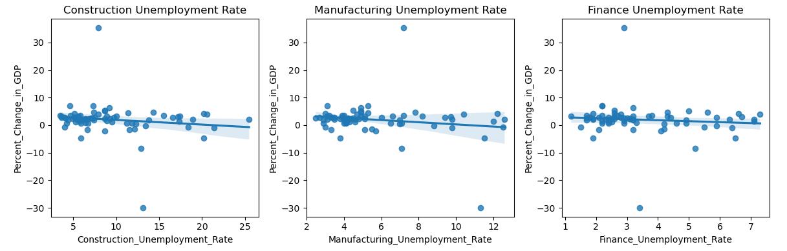

# Welcome to our team project website!

This is a website to showcase our final project for FIN 377 - Data Science for Finance course at Lehigh University.

This project and website was created by Tim DiPalo, Tom Griffith, and Christyan Jean-Charles.

To see the complete project repo, click [here](https://github.com/tdip19/FinalProject).

## Table of contents
1. [Introduction](#introduction)
    1. [Industry Choices](#subsec1-1)
    2. [Variable Choices](#subsec1-2)
2. [Methodology](#meth)
3. [Regression Analysis](#section2)
4. [Machine Learning Analysis](#section3)
    1. [ML Method 1](#subsec3-1)
    2. [ML Method 2](#subsec3-2)
5. [Visualizations and Analysis](#section4)
    1. [Construction](#subsec4-1)
    2. [Manufacturing](#subsec4-2)
    3. [Finance](#subsec4-3)
6. [Findings and Conclusion](#conc)
    1. [Conclusion](#subsec5-1)
7. [About the Team](#about)

## Introduction  <a name="introduction"></a>

The main goal of this project is to explore how we can use past data on industry trends and leading indicators to predict future employment and economic trends. We chose to explore this topic because, as we and our peers begin to move into the working world, we believe it is important to understand unemployment as it relates to job security. Especially now with many people predicting a recession, we think it is important to understand the employment trends in popular industries as they relate to economic trends.

### Industry Choices: <a name="#subsec1-1"></a>

**Construction:** This was the inspiration for this project. While exploring topics, Tom stumbled upon this [video](https://www.youtube.com/watch?v=roEljzOKk3I&ab_channel=EPBResearch), detailing how construction employment is a significant driver of recessions in the US economy. We originally wanted to explore how different industries drive recessions, but we later decided to switch the angle in which we approached the project, instead of researching how economic conditions affect unemployment in different industries. We felt that we should keep the construction industry as a homage to our original inspiration for the project.

**Manufacturing:** As supply chain majors, the manufacturing industy is important to Tim and Tom. Additionally, it is an industry that is very relevant to recent and soon-to-be Lehigh graduates overall.

**Finance:** This one is pretty clear. Since this is a finance class, most of us students are finance majors, and will likely be entering the finance industry soon. Therefore, it is important to understand the potential impact that economic conditions will have on employment rates.

### Variable choices: <a name="#subsec1-2"></a>

**S&P 500 Returns:**  The S&P 500 (SP500) is a stock market index that measures the performance of 500 large companies listed on stock exchanges in the United States. It can be used as a proxy for economic health while providing insight into how the stock market is responding to economic trends. Because it is such a widely used indicator in finance for the performance of our economy, we felt it was fitting. Our SP500 figures are the total percentage of returns over the quarter. 

**GDP:** Gross Domestic Product (GDP) measures the growth and contraction of the economy. When GDP is increasing, it generally indicates that more goods and services are being produced, which can lead to increased employment opportunities. Therefore, a positive percent change in GDP may lead to lower unemployment rates. We chose percent changes rather than the GDP number to better reflect small changes in the figure over each quarter. We also thought that GDP would be specifically helpful in predicting Manufacturing and Construction employment trends. 

**CPI:** The Consumer Price Index (CPI) is a measure of inflation, which reflects the change in the price level of a basket of goods and services purchased by households over time. If the CPI is rising, it can indicate an increase in the cost of living, which may impact consumer spending, business investment, and job creation. Therefore, we thought while being a good indicator of economic health, changes may have an impact on unemployment. 


## Methodology <a name="meth"></a>

We began by gathering data. We were able to find most of the employment data we needed from the Bureau of Labor Statistics and the Bureau of Economic Analysis. This was convinient because, by getting the data from the same/similar sources, they were all formatted similarly. Therefore, there was minimal work needed to clean the data and prepare it for a merge.

Then, we were able to complete the minimal cleaning of the data so it was ready to merge, then merge it. The merged dataframe can be seen below.


<br><br>

## Regression Analysis <a name="section2"></a>
Before we began analyzing the regression models, we thought it was important to first visualize the data. We set up our financial metrics (S&P500 Returns, CPI, and GDP Percent Change) as our Y variable and the unemployment rates (Construction, Finance, and Manufacturing) as our X variable.   
<br><br>

<br><br>
We noticed that all three X variables had a slight positive relationship with the S&P 500 returns. However, this relationship was not strong enough to establish a statistically significant correlation between the three variables. 
<br><br>

<br><br>
The same could be said when looking at the relationship between GDP Percent Change and the three unemployment rates. There is a slight negative relationship between the three variables. Similar to the previous graph, there isn't a strong relationship between the variables to infer that the graph contains any statistically significant correlation.
<br><br>

<br><br>
When looking at each sectors' unemployment rates compared to CPI, we noticed a strong negative relationship. We analyzed that a strong negative relationship between unemployment rates and CPI could possibly suggest that as unemployment rates decrease, CPI tends to increase. 

After examining each data visualization, we decided to further analyze each relationship by using OLS regression models. By fitting an OLS regression model, we could estimate the strength and direction of the relationship between the dependent variable (the financial metrics) and the log of each independent variable (industry unemployment rate). 
<br><br>

<br><br>
In all four models, we noticed the R-squared values were relatively low, ranging from 0.01 to 0.05. This suggests that the independent variables included in the models do not explain a large proportion of the variation in the S&P 500 returns. The adjusted R-squared values are even lower, suggesting that the independent variables may not be good predictors of the S&P 500 returns. 

A one percent increase in the construction unemployment rate led to a .0002 increase in the S&P500 return value. Whereas a one percent increase in the manufacturing unemployment rate led to a .0003 increase in the S&P500 returns. Finally, a one percent increase in the finance unemployment rate led to a .0002 increase in the S&P500 returns.
<br><br>

<br><br>
The R-squared and the adjusted R-squared were also relatively low when looking at the relationship between GDP and each sector's unemployment rate. A one percent increase in the construction unemployment rate led to a -.0172 decrease in GDP Percent Change. While a one percent increase in the manufacturing unemployment rate led to a -.0197 decrease in GDP Percent Change. Q one percent increase in finance unemployment rate led to a -.0130 decrease in GDP Percent Change.
<br><br>

<br><br>
The coefficients of the unemployment rates are all negative, but not all of them are statistically significant at conventional levels. The coefficient of Construction_Unemployment_Rate is statistically significant at the 1% level, which suggests that an increase in the Construction unemployment rate is associated with a decrease in CPI. The coefficient of Finance_Unemployment_Rate is statistically significant at the 5% level, which suggests that an increase in the Finance unemployment rate is associated with a decrease in CPI. However, the coefficient of Manufacturing_Unemployment_Rate is not statistically significant, which suggests that there is no evidence of a significant relationship between this variable and CPI.

The R-squared values are low in all four regressions, indicating that the unemployment rates explain only a small portion of the variation in CPI.

A one percent increase in the construction unemployment rate led to a -.2346 decrease in CPI. While a one percent increase in the manufacturing unemployment rate led to a -.2673 decrease in CPI. A one percent increase in finance unemployment rate led to a -.2990 decrease in CPI.

## Machine Learning Analysis <a name="section3"></a>

To further analyze the relationship between economic indicators and industry unemployment, we employed different methods of machine learning. Our goal was to train a model to most accurately predict a given level of unemployment in an industry based on certain economic conditions. 

### "ML" Method 1: <a name="subsec3-1"></a>
For our first attempt, we created a model that attempts to place a value based on the line best fit using the three variables. 

```python 

X = recession_df[['SP500_Return', 'Percent_Change_in_GDP', 'CPI']]
y = recession_df['Construction_Unemployment_Rate']

model = LinearRegression()
model.fit(X,y)

predictions = model.predict(X) 
recession_df['Predicted_Construction_Unemployment_Rate'] = predictions
```

Since this model does not use any learning of test data. It turns out that it is not that accurate. 

| Industry     | R<sup>2</sup>         |
|--------------|------------|
| Construction | 0.208536   |
| Manufacturing        | 0.222904   |
| Finance          | 0.223606   |


### ML Method 2 <a name="subsec3-2"></a> 


To create a better model for each industry, we used training and testing samples of 70% and 30% of our dataset. We also included a num and cat transformer into the model as well as did preprocessing. 

The code below shows an example of one of our models that outputs the R<sup>2</sup> score, the industry predictions, and the length of the training data:

```python 

X_train_c, X_test_c, y_train_c, y_test_c = train_test_split(
    merged.drop('Construction_Unemployment_Rate', axis=1),
    merged['Construction_Unemployment_Rate'],
    test_size=0.3,
    stratify=merged['Year']
) 

num_transformer = Pipeline(steps=[
    ('scaler', StandardScaler())
])

cat_transformer = Pipeline(steps=[
    ('onehot', OneHotEncoder(handle_unknown='ignore'))
]) 

#Preprocessor
preprocessor = ColumnTransformer(transformers=[
    ('num', num_transformer, ['SP500_Return', 'Percent_Change_in_GDP', 'CPI']),
    ('cat', cat_transformer, ['Year', 'Period'])
]) 

#Define the model as a pipeline of the preprocessor/linear regression model
model_c = Pipeline(steps=[
    ('preprocessor', preprocessor),
    ('regressor', LinearRegression())
]) 

#Train on training data
model_c.fit(X_train_c, y_train_c)

# Predict on the testing data
y_pred_c = model_c.predict(X_test_c)

# Evaluate the model
score_c = model_c.score(X_test_c, y_test_c)
print(f'R^2 score: {score_c}') 

print(y_pred_c)
len(X_train_c)
``` 

This model gave us a much better estimate of unemployment by industry. The highest R<sup>2</sup> was for construction, which supported our initial idea that the construction industry is heavily tied to economic indicators. 

| Industry | R<sup>2</sup> |
|:--------:|:-------------:|
| Construction | 0.8545 |
| Manufacturing | 0.5891 |
| Finance | 0.7938 |

## Plots and Visualization <a name="section4"></a>

To visualize the accuracy of machine learning, we used a scatterplot, a density plot, and a residual plot. These plots all compare the predicted results from our machine learning model to the actual data from our dataset.

### Construction <a name="subsec4-1"></a>


<br><br>
This plot shows how our predicted values for the unemployment (red) correlate with the actual values in the dataset (blue).
<br><br>

<br><br>
This plot overlays our predicted values for the unemployment (orange) with the actual values in the dataset (blue), showing how closely they correlate.
<br><br>

<br><br>
This plot shows how far our predicted values for the unemployment deviate from the actual values in the dataset, with the red line representing 0, or no deviation from each other. This plot is useful because it additionally colors the points by the timeframe, so we can see which timeframes we predicted more accurately than others.

### Manufacturing <a name="subsec4-2"></a>


<br><br>
This plot shows how our predicted values for the unemployment (red) correlate with the actual values in the dataset (blue).
<br><br>

<br><br>
This plot overlays our predicted values for the unemployment (orange) with the actual values in the dataset (blue), showing how closely they correlate.
<br><br>

<br><br>
This plot shows how far our predicted values for the unemployment deviate from the actual values in the dataset, with the red line representing 0, or no deviation from each other. This plot is useful because it additionally colors the points by the timeframe, so we can see which timeframes we predicted more accurately than others.

### Finance <a name="subsec4-3"></a>


<br><br>
This plot shows how our predicted values for the unemployment (red) correlate with the actual values in the dataset (blue).
<br><br>

<br><br>
This plot overlays our predicted values for the unemployment (orange) with the actual values in the dataset (blue), showing how closely they correlate.
<br><br>

<br><br>
This plot shows how far our predicted values for the unemployment deviate from the actual values in the dataset, with the red line representing 0, or no deviation from each other. This plot is useful because it additionally colors the points by the timeframe, so we can see which timeframes we predicted more accurately than others.

## Findings and Conclusion <a name="conc"></a>

**Our final R<sup>2</sup> values are as follows:**

| Industry | R<sup>2</sup> |
|:--------:|:-------------:|
| Construction | 0.8545 |
| Manufacturing | 0.5891 |
| Finance | 0.7938 |

These values are clear in the plots: 

The construction industry has the highest R<sup>2</sup>, and that can be seen through the close correlation between the actual values and our predicted values.

For the manufacturing industry, you can see that there are certain outliers in the actual data that deviate from our predicted results. This can be seen specifically in the scatterplot and the residual plot.

The scatterplot and the residual plot for the finance industry seem to show actual values that deviate significantly from our predicted values, but by looking at the density plot, you can see that the values are closer to eachother than they seem.

Finally, we created a new dataset with randomly generated values for the S&P500 return, change in GDP, and CPI from 2023 to 2033. I created code that ensured those variables stayed within specified values, and that they somewhat correlated with each other as they do in reality. The code that I used to do this is as follows:

```python
# random numbers for 10 years

np.random.seed(1234)

# create list of periods
periods = ['Q01', 'Q02', 'Q03', 'Q04']

# create empty df
data_random_10 = pd.DataFrame(columns=['Year', 'Period', 'SP500_Return', 'Percent_Change_in_GDP', 'CPI'])

# create columns
years = np.repeat(np.arange(2023, 2033), 4)
data_random_10['Year'] = years
data_random_10['Period'] = periods*10

n_quarters = len(years)
data_random_10['SP500_Return'] = np.random.uniform(low=-0.18, high=0.21, size=n_quarters)
data_random_10['Percent_Change_in_GDP'] = np.random.uniform(low=-20, high=25, size=n_quarters)
data_random_10['CPI'] = np.random.uniform(low=200, high=320, size=n_quarters)

data_random_10['Percent_Change_in_GDP'] = data_random_10['Percent_Change_in_GDP'] * (1 + 0.5*data_random_10['SP500_Return'])
data_random_10['CPI'] = data_random_10['CPI'] * (1 + 0.3*data_random_10['SP500_Return'])

data_random_10 = data_random_10.round(2)
data_random_10
```

Now that I created that dataset, I trained our model that we used before on all of the original dataset, to give it the largest sample size possible. Then, I was able to predict unemployment rates for each industry for these randomly generated variables all the way up to 2033. The dataset with the predicted unemployment rates on the randomized values:


<br><br>

### Conclusion <a name="subsec5-1"></a>

Finally, these results show that **employment in the manufacturing industry is the most resistant to economic changes** since it has the lowest R<sup>2</sup>. Since we weren’t able to predict it very accurately, it means that the three leading variables that we chose (S&P500 return, change in GDP, and CPI) may not impact the unemployment rate in the manufacturing industry significantly. There may be other variables that impact it more. **The construction and finance industries change more as a result of changes in these variables** and are therefore more reactive to economic changes since they have higher R<sup>2</sup>s. Because we were able to predict them fairly accurately, it shows that the leading variables likely have a stronger impact on the unemployment rates as compared to the manufacturing industry.

## About the team <a name="about"></a>


<br>
Tim is a junior at Lehigh studying finance and supply chain management.
<br><br>

<br>
Tom is a junior at Lehigh studying finance and supply chain management.
<br><br>

<br>
Christyan is a senior at Lehigh studying finance.
<br><br>
