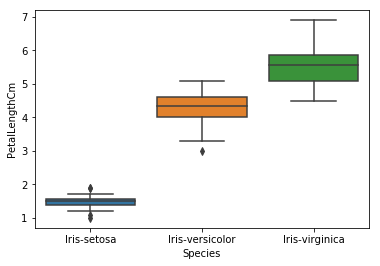

# Welcome to our [team project website!](https://julioveracruz.github.io/testwebsite/)

This is a website to showcase our final project for FIN 377 - Data Science for Finance course at Lehigh University.

To see the complete analysis file(s) click [here](https://github.com/julioveracruz/testwebsite/blob/main/notebooks/example.ipynb).

## Table of contents
1. [Introduction](#introduction)
2. [Methodology](#meth)
3. [Section 2](#section2)
    1. [Subsection](#subsec2-1)
    2. [Subsection](#subsec2-2)
4. [Analysis Section](#section3)
5. [Summary](#summary)

## Introduction  <a name="introduction"></a>

The main goal of this project is to explore how we can use past data on industry trends and leading indicators to predict future employment and economic trends. We chose to explore this topic because, as we and our peers begin to move into the working world, we believe it is important to understand unemployment as it relates to job security. Especially now with many people predicting a recession, we think it is important to understand the employment trends in popular industries as they relate to economic trends.

Why we chose these industries:


## Methodology <a name="meth"></a>

We began by gathering data. We were able to find most of the employment data we needed from the Bureau of Labor Statistics and the Bureau of Economic Analysis.

From there, we were able to clean the data so it was ready to merge, then merge it. The merged dataframe can be seen below.


<br><br>
Some analysis here

Here is some code that we used to develop our analysis. Blah Blah. [More details are provided in the Appendix](page2).
 
Note that for the purposes of the website, you have to copy this code into the markdown file and  
put the code inside trip backticks with the keyword `python`.

```python
import seaborn as sns 
iris = sns.load_dataset('iris') 

print(iris.head(),  '\n---')
print(iris.tail(),  '\n---')
print(iris.columns, '\n---')
print("The shape is: ",iris.shape, '\n---')
print("Info:",iris.info(), '\n---') # memory usage, name, dtype, and # of non-null obs (--> # of missing obs) per variable
print(iris.describe(), '\n---') # summary stats, and you can customize the list!
print(iris['species'].value_counts()[:10], '\n---')
print(iris['species'].nunique(), '\n---')
```

Notice that the output does NOT show! **You have to copy in figures and tables from the notebooks.**

## Regression Analysis <a name="section2"></a>
Christyan

### Subsection 1 <a name="subsec2-1"></a>
This is a subsection, formatted in heading 3 style

### Subsection 2 <a name="subsec2-2"></a>
This is a subsection, formatted in heading 3 style

## Machine Learning Analysis <a name="section2"></a>
Christyan

### Subsection 1 <a name="subsec2-1"></a>
This is a subsection, formatted in heading 3 style

### Subsection 2 <a name="subsec2-2"></a>
This is a subsection, formatted in heading 3 style

## Plots and Visualization <a name="section3"></a>

Here are some graphs that we created in our analysis. We saved them to the `pics/` subfolder and include them via the usual markdown syntax for pictures.


<br><br>
Some analysis here
<br><br>

<br><br>
More analysis here.
<br><br>

<br><br>
More analysis.

## Summary of Findings <a name="summary"></a>

Blah blah


## About the team


<br>
Tim is a junior at Lehigh studying finance and supply chain management.

<br>
Tom is a junior at Lehigh studying finance and supply chain management.
<br><br><br>

<br>
Christyan is a senior at Lehigh studying ______.


## More 

To view the GitHub repo for this website, click [here](https://github.com/donbowen/teamproject).
